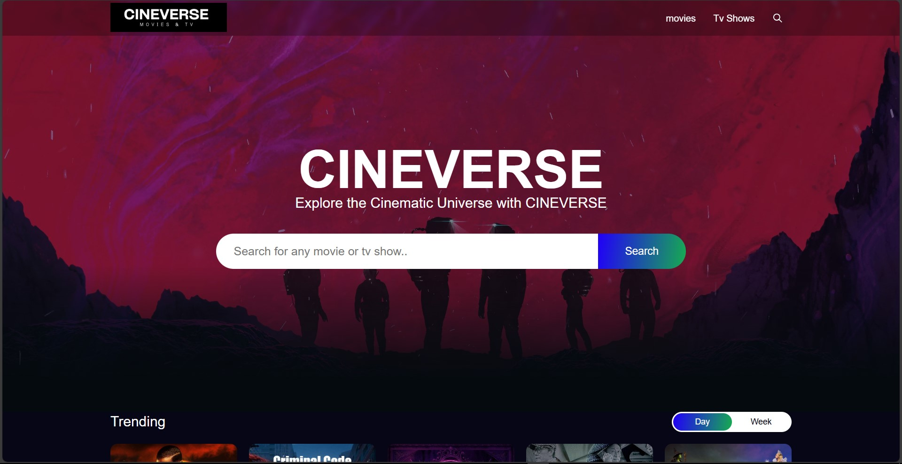
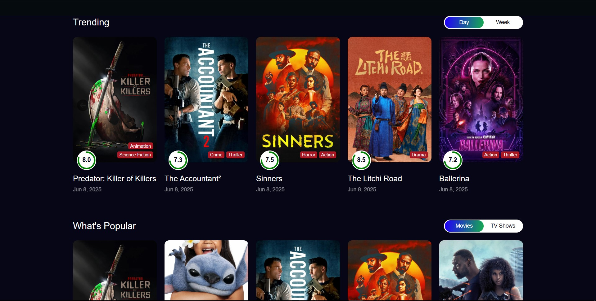
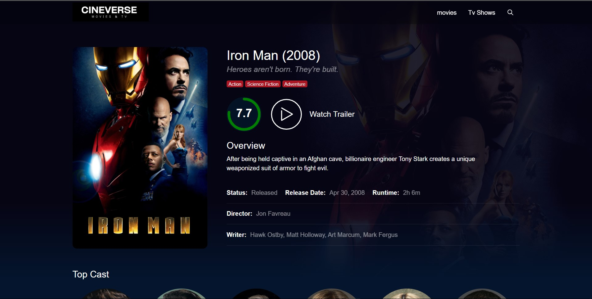
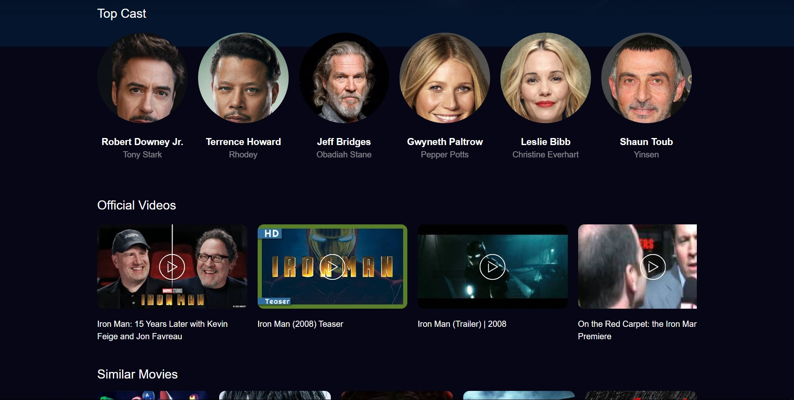
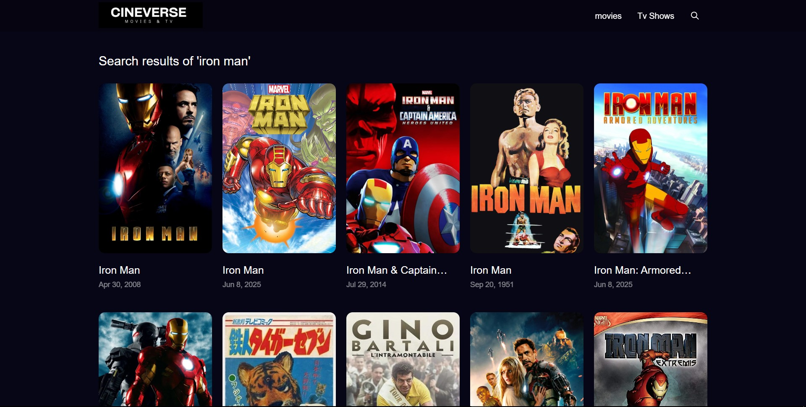

# 🎬 CineVerse

A dynamic movie and TV show discovery app built using **React.js**, **Redux Toolkit**, **Tailwind CSS**, and **SCSS**, with data powered by **The Movie Database (TMDB) API**.

## 🌟 Features

- 🔍 Browse 1000+ movies and TV shows
- 🎯 Filter by **genre**, **popularity**, and **ratings**
- ⚡️ Smart search with fast suggestions
- 📊 Performance-optimized using Redux Toolkit
- 🎨 Clean, responsive UI styled with Tailwind CSS & SCSS

## 🚀 Highlights

- 📉 Reduced API calls by **60%** using efficient Redux state management
- 🔎 Implemented an advanced filter algorithm that cut down user search time by **30%**
- 👥 Optimized for **100+ concurrent users** with smooth performance

## 🛠 Tech Stack

- **Frontend**: React.js, Redux Toolkit, Tailwind CSS, SCSS
- **API**: [TMDB API](https://www.themoviedb.org/)
- **State Management**: Redux Toolkit

## 📸 Screenshots

### 🏠 Homepage



### 🎬 Movie Details Page



### 🎬 Search Result Page



## 📦 Installation

```bash
git clone https://github.com/your-username/cineverse.git
cd cineverse
npm install
npm start

